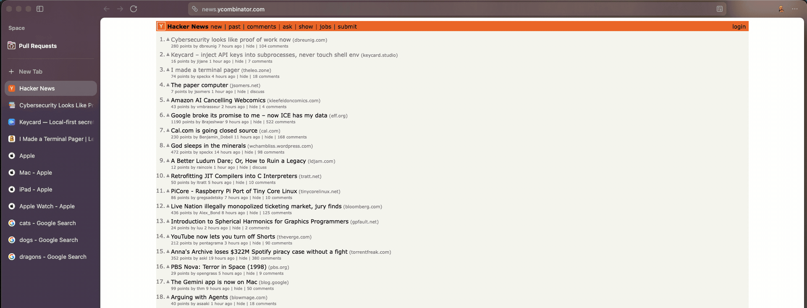

# guy-tab-ieri



A cross-browser extension (Chrome/Firefox) that lets you close all tabs from the same hostname in one click, themed to Guy Fieri.

## Usage

Click the extension icon in your toolbar. The popup lists every hostname open in the current window, sorted by tab count. Click **Close All** next to a host to close all its tabs immediately.

System pages (`chrome://`, `about:`, `file://`, etc.) are grouped under **chrome & system pages** and can be closed the same way.

## Project Structure

```
extension/       Extension source files (load this directory in Chrome)
  manifest.json
  popup.html
  popup.js
build-ff.sh         Packages the extension into guy-tab-ieri.xpi (Firefox)
test.js          Unit tests (Node.js)
```

## Development

### Run tests

```bash
node test.js
```

### Load in Chrome (unpacked)

1. Go to `chrome://extensions`
2. Enable **Developer mode** (top right toggle)
3. Click **Load unpacked** and select the `extension/` directory

The extension reloads automatically when you edit source files and click the refresh icon on `chrome://extensions`.

### Load in Firefox (temporary)

1. Go to `about:debugging` → **This Firefox**
2. Click **Load Temporary Add-on**
3. Select any file inside the `extension/` directory (e.g. `manifest.json`)

This persists until Firefox restarts.

## Building & Distributing

### Firefox (.xpi)

```bash
./build-ff.sh
```

Produces `guy-tab-ieri.xpi`. To install permanently on Firefox with signing disabled:

1. In Firefox, go to `about:config` and set `xpinstall.signatures.required` to `false`
2. Go to `about:addons` → gear icon → **Install Add-on From File**
3. Select `guy-tab-ieri.xpi`

### Chrome (sharing with a coworker)

Chrome blocks enabling any extension not installed from the Web Store, so `.crx` sideloading doesn't work in modern Chrome. The only reliable options outside the Web Store are:

**Load unpacked** (recommended) — share the `extension/` folder (or a zip of it). Your coworker:

1. Unzips it if necessary
2. Goes to `chrome://extensions`, enables **Developer mode**
3. Clicks **Load unpacked** and selects the folder

**Chrome Web Store** — for broader distribution, submit a zip of `extension/` at the Chrome Developer Dashboard. Required for installs that survive Chrome updates without developer mode.
